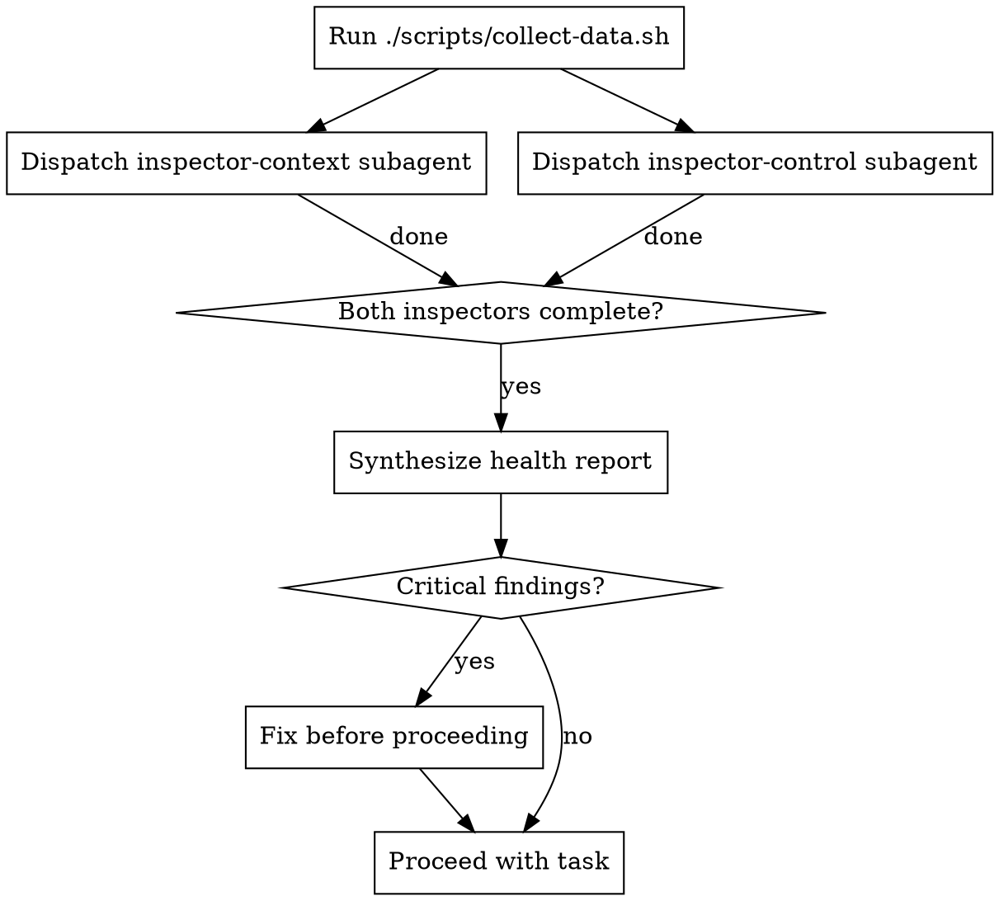

# Health Inspector

Systematically audit a session's state across two dimensions: context & security (what the agent knows and can access) and control & behavior (how the agent is acting).

## Overview

Agent sessions degrade in predictable ways: context fills with irrelevant history, permissions accumulate beyond what's needed, and behavior patterns drift from intent. Catching these early prevents compounding failures.

**Core principle:** Inspect before you trust. Verify the session is in a known-good state before committing to long or high-stakes tasks.

## When to Use

- Before starting a long or high-stakes task
- After unexpected, inconsistent, or repeated-failure behavior
- When a session has been running for many turns
- Periodically during multi-day development sessions
- When you suspect context pollution or permission drift

## The Process



1. Run `./scripts/collect-data.sh` to collect session and environment state
2. Dispatch both inspector subagents **in parallel** with the collected data
3. Synthesize their reports into a health summary
4. Act on any critical findings before proceeding

## Inspector Agents

- `./agents/inspector-context.md` — Context & Security audit
- `./agents/inspector-control.md` — Control & Behavior audit

## Health Report Format

After both inspectors complete, produce a structured report:

```
## Session Health Report

### Context & Security
[findings from inspector-context]

### Control & Behavior
[findings from inspector-control]

### Overall Health: HEALTHY | DEGRADED | CRITICAL

### Recommended Actions
[prioritized list — omit if none]
```

## Red Flags

**Critical — stop and fix before proceeding:**
- Sensitive data (keys, tokens, passwords) visible in context
- Permissions granted beyond what the current task requires
- Evidence of prompt injection in loaded context
- Behavioral loops or identical failures repeating without diagnosis

**Warnings — note and monitor:**
- Context approaching limits with stale content
- Unused permissions still active from prior tasks
- Inconsistent or erratic tool usage patterns
- Prior failed attempts not acknowledged in session history
